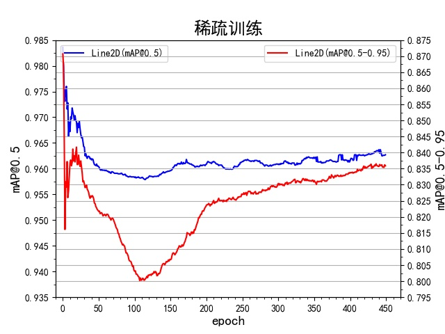
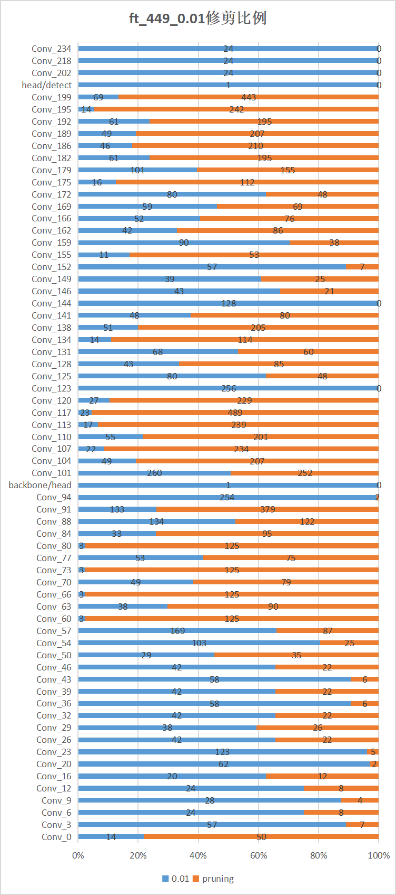
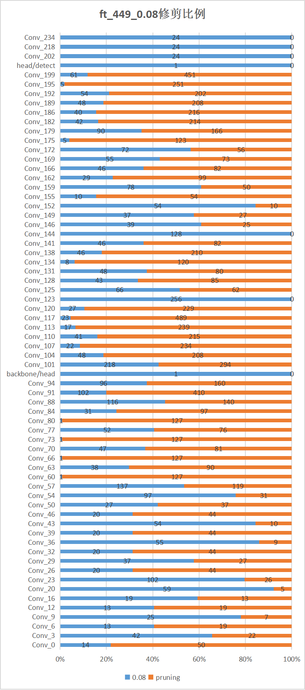

<big><b>YOLOv5剪枝算法测试报告</b></big>

[概要](#1-概要)

[1 剪枝策略](#1-剪枝策略建)

[2 工程准备](#2-工程准备)

[3 单次剪枝流程](#3-单次剪枝流程)

[4 迭代剪枝](#4-迭代剪枝)

[5 工程移植](#5-工程移植)

[6  总结](#6-总结)

# 概要

​		利用通道剪枝算法获取较精简的网络结构，实现保留精度的条件下使得推理耗时由1.9ms下降至0.8ms，优于通道减半的1.0ms。总结剪枝算法原理，给出后续优化方向，如精度恢复手段及数据集整理。

# 1 剪枝策略

## 1.1 剪枝策略选型

依据剪枝粒度可以划分为非结构化剪枝和结构化剪枝，其中非结构剪枝是对卷积核进行稀疏，导致卷积核内存在大量0权重，这需要额外硬件加速模块实现推理加速；而结构剪枝是切实将多卷积核去除，按去除程度大致分为通道（卷积核）剪枝和卷积层剪枝。考虑到yolov5s属于轻量化模型，因此采用通道剪枝。

而通道剪枝的关键在于度量各卷积核的重要程度，针对不同评价手段效果大相径庭，近年难点是残差网络如ResNet的跳跃结构不利于逐层剪枝，因此需要额外的补齐手段将前后特征对齐。

本测试采用基于全局阈值搭配稀疏训练来实现功能，其中，稀疏训练是在BN层引入缩放因子，在L1正则化的作用下会与归一化处理想抵消，达到不新增新参数效果。稀疏训练结束后可以根据设定全局阈值来筛选过小的缩放因子(一般认为，缩放因子越大即对output贡献越大)。

## 1.2 剪枝有效性分析

《Rethinking the Value of Network Pruning》——剪枝留下的结构要比权重重要。剪枝的目的是获取简化的网络结构，而不是模型本身。

《The Lottery Ticket Hypothesis: Finding Sparse, Trainable Neural Networks》——MIT研究员提出的彩票假设：剪枝后能恢复精度的模型，称为中奖网络，而迭代剪枝更容易获取中奖网络。

《One Ticket to Win Them All: Generalizing Lottery Ticket Initializations Across Datasets and Optimizers》——facebook团队针对中奖网络分别从迁移实验和数学推理，对其有效性以及泛化能力进行验证。

## 1.3 剪枝技术路线

考虑到采用的检测策略是one-shot，即不能根据预期模型大小实现自动迭代剪枝，因此需要设置不同全局阈值多次one-shot实现人工迭代剪枝。

![[YOLOv5剪枝测试报告]剪枝技术路线](D:\1-gitlab\AI_BarCode_Detect_Yolo\doc\img\[YOLOv5剪枝测试报告]剪枝技术路线.png)

当剪枝比例过大导致骤降，可采用知识蒸馏恢复精度。它实际是输入两个模型：Teaher模型和Student模型，然后让Teacher模型去（离线）指导Student模型的训练。与微调的区别，微调时样本是严格one-hot的，Teacher模型可以给出连续的label分布，可以有效弥补监督信号不足。

# 2 工程准备

## 2.1 测试环境及代码变动

主要依赖环境为服务器vision001-yolo工程，在原有框架上加载[剪枝工具包API](https://github.com/VainF/Torch-Pruning)（[理论基础](https://arxiv.org/abs/1608.08710)）

剪枝代码已整合上传至git

- 稀疏训练相当于模型微调时对bn层进行处理，增加稀疏损失sl_loss计算及记录（[稀疏训练理论基础](https://arxiv.org/abs/1708.06519)）
- 基于剪枝API编写卷积核去除脚本pruning.py
- 新增剪枝后模型微调，绕过模型配置文件直接加载模型

## 2.2 数据集

训练集&验证集：[dmcode](http://172.16.102.80/#/image-display?storeId=37&type=1): 5736张； [qrcode](http://172.16.102.80/#/image-display?storeId=38&type=1): 5538张； [barcode](http://172.16.102.80/#/image-display?storeId=36&type=1): 8728张； [multicode(去除测试集)](http://172.16.102.80/#/image-display?storeId=46&type=1): 8128张； 共28130张   

测试集： 3112张

# 3 单次剪枝流程

## 3.1 运行流程

大参数模型（original模型）采用YOLOv5s（epoch=578），此时模型拟合。

训练流程首先设定稀疏阈值对original模型进行稀疏训练；然后稀疏训练得到的模型，通过设置剪枝阈值完成剪枝；最后，为恢复原有精度，对剪枝后的模型进行微调。

⭐剪枝整个过程关键在于找到合适的剪枝阈值，从而合理地缩减推理时间。

## 3.2 稀疏训练（稀疏阈值6e-4）

稀疏分布可视化如左图（Y轴权重数，X轴稀疏度sl_loss），mAP变化曲线如右图。

随着epochs增加，稀疏度凸峰逐渐向左移，平均稀疏度逐渐降低，并出现大量近似0值(这部分对应的卷积层能无损去除)；但是map从最开始骤降后上升，然后经历一个凹峰后逐渐拟合，具体原因未知，理想状态下map可以恢复至原来精度。

## 3.3 剪枝效果

设定剪枝阈值，将小于该阈值下的卷积层全部去掉，并根据跳跃结构补齐通道数。此时的pruning模型由于网络结构发生变化，特征信息缺失会导致精度严重下降，因此要进行微调，微调epochs会根据剪枝阈值的大小有所不同，一般剪枝阈值趋于0时微调epochs只需50epochs。

由于稀疏模型未完全拟合且拟合时间过长，因此适当增大剪枝阈值以获取期望剪枝幅度。首先会通过**预剪枝**，探索不同剪枝阈值的效果，通过通道减半的推理耗时来界定剪枝阈值范围；**实际剪枝**会适当增加稀疏epochs，基于预剪枝得到的剪枝阈值完成剪枝。

### 3.3.1 精度及速度

预剪枝模型取稀疏训练epoch=171，从精度损失最小化以及极限剪枝的角度，剪枝阈值分别选取0.01与0.2作为测试组，后续补充了折中阈值0.1；实际剪枝模型取稀疏训练epoch=449，剪枝阈值分别选取0.08和0.01

下表统计<a name="all0">各模型的测试效果</a>(iou_thres=0.5)，模型命名方式为'训练模型'+'稀疏训练epoch'+'剪枝阈值'，推理耗时为PC端多次检测的平均值。

|  序号  |             模型             |           mAP@0.5            |     ▲      |               mmAP               | 模型大小  |             推理耗时             | FLOPs |     备注     |
| :----: | :--------------------------: | :--------------------------: | :--------: | :------------------------------: | :-------: | :------------------------------: | :---: | :----------: |
|   1    |    [original](#混淆矩阵0)    | 0.982 |     0      |              0.862               |   15.1M   | **2.0ms** | 18.6G |     拟合     |
|   2    |           1/2通道            |            0.956             |   -0.027   |              0.837               |   3.9M    |              1.0ms               | 4.4G  |     拟合     |
|   3    |           1/4通道            |            0.961             |   -0.021   |              0.808               |   1.2M    |              0.6ms               | 1.1G  |     拟合     |
| 分隔行 |              -               |              -               |     -      |                -                 |     -     |                -                 |   -   |      -       |
|   4    |            sl171             |            0.961             |   -0.021   |              0.813               |   15.1M   |              2.0ms               | 18.6G |              |
|   5    |          ft171_0.01          |            0.966             |   -0.016   |              0.828               |   3.33M   |              1.3ms               | 6.9G  |   50epochs   |
|   6    |          ft171_0.2           |            0.934             |   -0.048   | **0.661** |   488K    |              0.7ms               | 1.3G  |   50epochs   |
|   7    |          ft171_0.1           |            0.957             |   -0.025   |              0.803               |   1.53M   |              1.0ms               | 3.7G  |   基本拟合   |
| 分隔行 |              -               |              -               |     -      |                -                 |     -     |                -                 |   -   |      -       |
|   8    |            sl449             |            0.963             |   -0.019   |              0.836               |   15.1M   |              2.0ms               | 18.6G |              |
|   9    | **[ft449_0.08](#混淆矩阵6)** |          **0.962**           | **-0.020** |            **0.825**             | **1.62M** |            **1.0ms**             | 3.8G  | **基本拟合** |
|   10   | **[ft449_0.01](#混淆矩阵5)** |          **0.965**           | **-0.017** |            **0.838**             | **2.48M** |            **1.2ms**             | 5.5G  | **基本拟合** |

预期推理耗时应小于通道减半推理耗时(1ms)，因此预剪枝得到剪枝阈值应为0.1附近，见序号7；实际剪枝精度略高于通道减半，但小目标检测效果(mmAP)略低于通道减半。

### 3.3.2 剪枝效果分析

以下统计ft_449_0.01和ft_449_0.08的各卷积层的通道剪枝情况，其中蓝色为目前通道数，橙色为已修剪部分。

 

被剪枝部分主要位于head结构且比例远远低于50%，其中conv123和conv144为反卷积层，由于没有bn层并不支持剪枝，其通道最终补齐至原来数量。而backbone结构随着剪枝阈值逐渐增加，剪枝比例会有所上升，由原来不足20%上升至接近50%。

## 3.4 结果分析

### 3.4.1 推理耗时

从3.3.2中与通道减半对比(通道减半相当于各卷积层且包括反卷积层的剪枝比例为50%)，推理耗时主要集中在backbone中，而且head结构相对冗余，基本可以无损剪裁。因此，如下表，在推理耗时相近的情况下，剪枝模型剪枝比例远远高于50%。

|    模型     | 模型大小 | 推理耗时 | 剪枝比例 |
| :---------: | :------: | :------: | :------: |
|   1/2通道   |   3.9M   |  1.0ms   |   50%    |
| ft_449_0.01 |  2.48M   |  1.2ms   |  62.6%   |
| ft_449_0.08 |  1.62M   |  1.0ms   |   69%    |

其原因可能是模型依旧不够稀疏导致。后续可以进一步增大稀疏阈值测试精度，或者进行迭代剪枝。

此外，剪枝比例间接描述参数量的减少比例；而计算量FLOPs加权统计参数量范围次数，它与推理耗时相关性更高。

### 3.4.2 检测效果分析

剪枝后精度下降主要是小样本误检率上升，新增模型保存策略，以权衡精准率和召回率的F1参数作为模型保存指标。

# 4 迭代剪枝

## 4.1 运行流程

重新定义剪枝后各剪枝层方便模型配置文件加载，同时人工对齐反卷积层。考虑到ft_449_0.08精度损失较大，迭代剪枝采用的模型为ft_449_0.01，剪枝流程如3.1

## 4.2 迭代剪枝速度和精度

下表统计各迭代剪枝后的模型测试效果(iou_thres=0.5)，模型命名方式为'IMP0.01'+'迭代次数'，其中在新数据集下进行为微调，剪枝阈值恒为0.01。

| 序号 |       模型       |              mAP50               |              mmAP               | 模型大小 | 推理耗时 | FLOPs |          备注          |
| :--: | :--------------: | :------------------------------: | :-----------------------------: | :------: | :------: | :---: | :--------------------: |
|  1   | original_new_640 | **0.993** | **0.94** |  14.3M   |  1.9ms   | 17.5G | 新数据集并调整backbone |
|  2   |   IMP0.01_1st    |               0.99               |              0.931              |  2.48M   |  1.1ms   | 5.5G  |                        |
|  3   |   IMP0.01_2nd    |              0.985               |              0.906              |  1.74M   |  0.8ms   | 3.6G  |    sl600_ft800(f1)     |
|  4   |   IMP0.01_3rd    |                /                 |                /                |  1.58M   |    /     | 3.3G  |        sl532_ft        |
|  ⭐   |     0.5_640      |              0.986               |              0.909              |   3.9M   |  0.9ms   | 4.4G  |         对照组         |

剪枝方案单次剪枝能保留较好的精度。随着剪枝次数的增多，精度下降越为明显且推理耗时越为缓慢。其中序号3精度与通道减半模型接近且推理耗时稍微提升。其效果要优于单次剪枝的ft449_0.08。

# 5 工程移植

**问题**：PC端测试尚不存在精度和速率问题，但在海思端出现严重的精度速率偏移；**原因**：剪枝后的通道数为奇数，导致海思平台不能完全并行加速。**解决措施**：新增自定义网络结构，对通道数进行8倍补齐，称该操作为nas。

## 5.1 新数据集微调下的速度和精度

考虑到通道补齐会导致推理耗时增大，为此迭代模型的nas采用IMP0.01_2nd的backbone和IMP0.01_3rd的head，训练得到nas_final；而单次剪枝nas采用ft449_0.08，，训练得到nas_0.08。各模型通道对齐后的检测效果如下表

| 序号 |       模型       | mAP50 | mmAP  | FLOPs | 推理耗时 | 模型大小 |        备注         |
| :--: | :--------------: | :---: | :---: | :---: | :------: | :------: | :-----------------: |
|  1   | original_new_640 | 0.993 | 0.94  | 17.5G |  1.9ms   |  14.3M   |      新数据集       |
|  2   |   0.5_640_new    | 0.992 | 0.875 | 4.4G  |  0.9ms   |   3.9M   |  通道减半，对照组   |
|  3   |    ft0.01_640    | 0.99  | 0.931 | 5.5G  |  1.1ms   |  2.48M   |      单次剪枝       |
|  4   |     nas_0.08     | 0.983 | 0.873 | 3.2G  |  0.7ms   |  1.16M   |   基于ft449_0.08    |
|  5   |    nas_final     | 0.985 | 0.905 | 3.6G  |  0.8ms   |  1.72M   | 基于序号3的迭代剪枝 |

## 5.2 结果分析

mAP精度方面各模型效果相差不大；mmAP精度方面，模型3>模型5>模型2>模型4；推理耗时方面，模型4>模型5>模型2>模型3。nas_final综合效果最佳，其剪枝情况如下图，剪枝比例达到72.6%。

# 6 总结

在给定数据集下进行剪枝能得到较精简的网络模型，在此基础上需要对通道进行补齐及微调。实验显示该剪枝方案要优于通道减半。针对剪枝模型不能恢复原有精度，后续将对数据集质量进行分析，并采用知识蒸馏策略尝试恢复精度。

