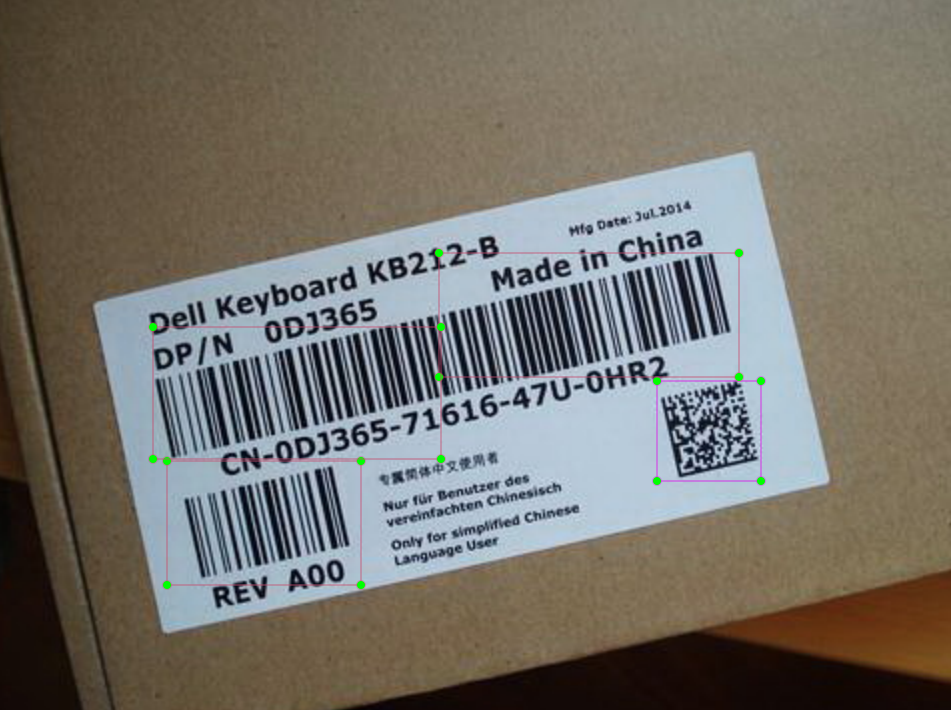
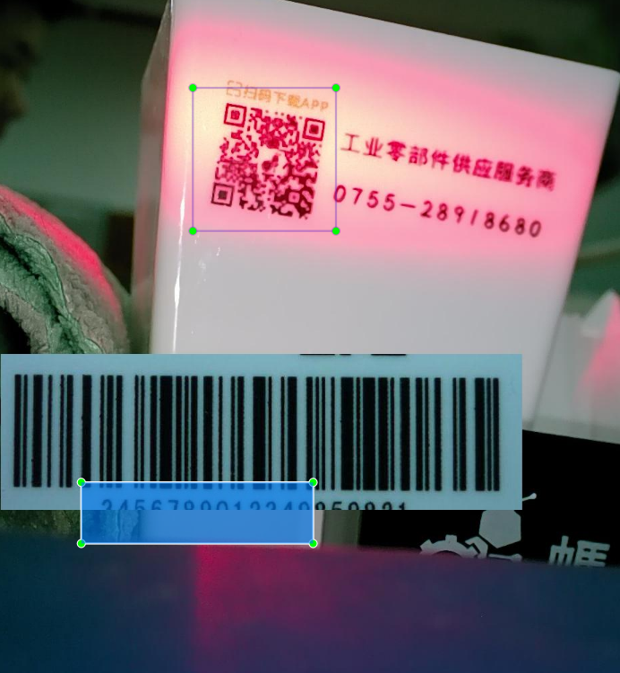
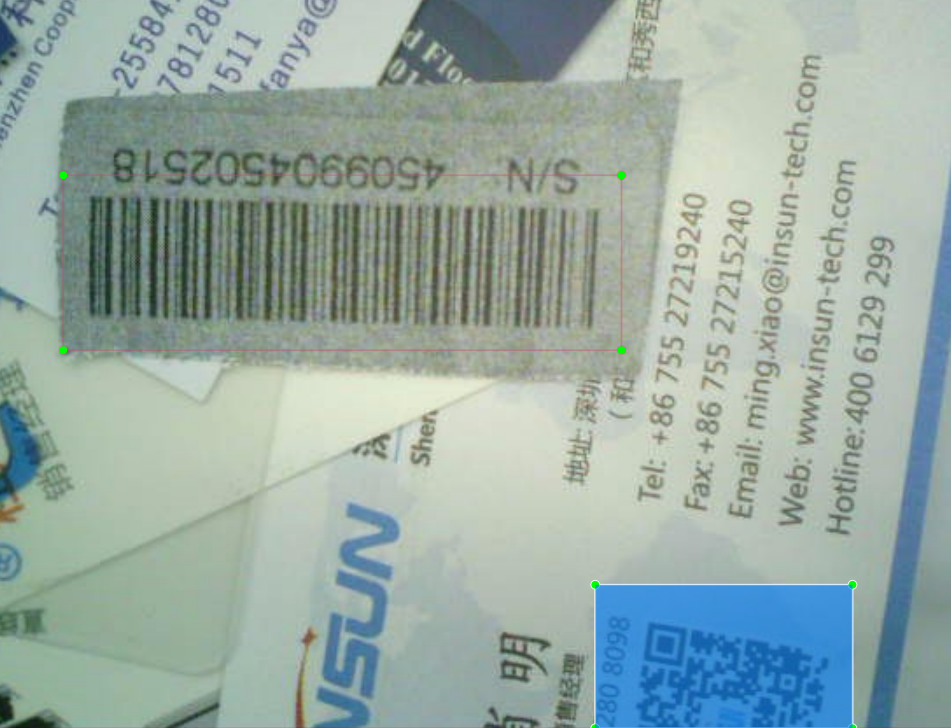
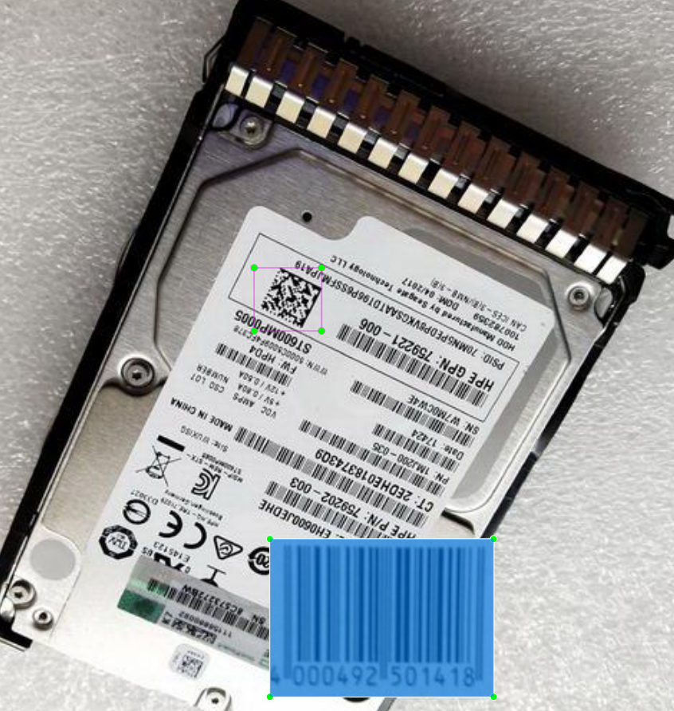
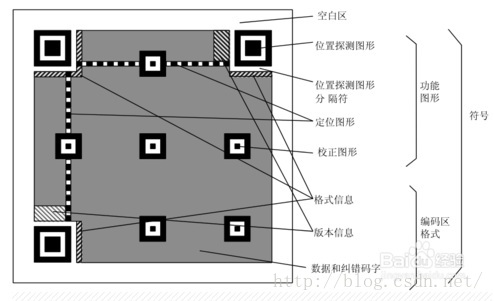
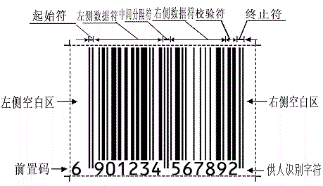
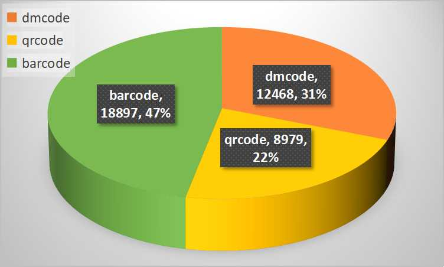
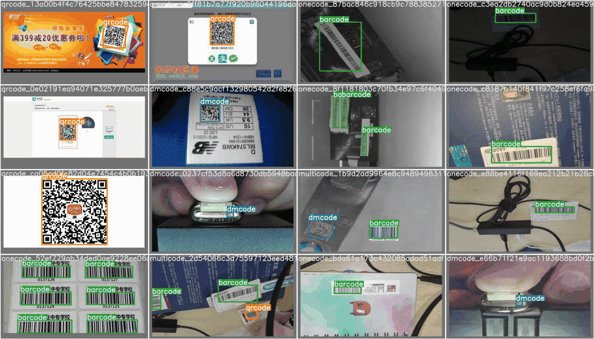

<big><b>条码数据集调整测试报告</b></big>

[概要](#1 概要) 

[1 条码数据集](#1-条码数据集) 

[2 数据集测试](#2-数据集测试)

[3 总结](#3-综合分析) 

# 概要

数据标注质量是影响模型性能的关键因素，标注准则参考VOC指导条码标注。

**调整后模型精度显著增大(map50由0.927→0.997)，漏检率和误检率有所下降且bbox回归更精确，但对旋转样本、困难样本识别有所提升但依旧欠佳。**后续增加大角度倾斜barcode和dpm样本。

# 1 条码数据集

应用场景：通用场景下的dmcode & qrcode & barcode识别检测。<补充条码详细类型说明>

## 1.1 现存问题

起因：部分条码检测得分较低，偶尔出现**截断现象**，dm码**残缺码误识率较高**，**预测框冗余度高**。

原因追溯：实际样本标注存在较大误差，包括**超出边界**、**标注错位**、**目标漏标注**及**标注不精确**等问题，如下图。

## 1.2 调整方针

①参照VOC标注准则：

> 1. 去除所有被遮挡大于5%的目标
>2. 模糊但外形完整(不含拖影)需要标注
> 3. 图片中所有物体必须标注，不易标注样本应当去除

②结合条码外形特征及纠错能力

​		如上，考虑到dmcode和qrcode均可通过位置标识实现定位，数据区域具备一定纠错能力。因此标注重点是**保证外轮廓的完备性**；而对于barcode则要保证数据符粗细，其中**供人识别字符(数字标识)可不包含在标注范围内**。

## 1.3 数据集变化

| 图片组成 | dmcode | qrcode | barcode | multi |  sum  |
| :------: | :----: | :----: | :-----: | :---: | :---: |
|  原数量  |  6430  |  9866  |  5620   | 8227  | 30143 |
| 目前数量 |  6417  |  5343  |  5619   | 8156  | 25535 |

**为探索yolo对旋转目标的识别情况，最新数据集移除大角度旋转数据集（3997张）。**此外图片数下降是由于移除了难标注样本和重复样本，部分是标注不精确，一部分是由于数据增强导致标注框偏移。目前数据集数量分布较均匀，但是**实际标签分布存在不平衡**，主要是由于人工生成大量qrcode作为多类样本，具体分布如下

考虑到数据集样本量级过大而类别较少，因此划分比例应该向训练集倾斜。

|   图片组成   | train/比例 | val/比例  | test/比例 |
| :----------: | :--------: | :-------: | :-------: |
| 原数据集划分 | 24330/0.81 | 2701/0.09 | 3112/0.1  |
| 现数据集划分 | 25024/0.98 | 255/0.01  | 256/0.01  |

# 2 数据集测试

## 2.1 测试环境

主要依赖环境为服务器vision002，算法框架选取[YOLOv5_v4.0](https://github.com/ultralytics/yolov5/tree/v4.0)，模型为基于5s的通道减半。**由于目前数据集gt相对精确，因此yolo工程自带的测试脚本具备有效性，本报告均默认基于脚本统计结果。**

## 2.2 测试结果对比

选取各自最佳模型(模型基本拟合)进行对比，conf-thres=0.5，iou-thres=0.5；其中查准率P=TP/(TP+FP)  查全率R=TP/(TP+FN)，因此误检率为1-P，漏检率为1-R；其中mmAP是取自于0.05mAP50-mAP95范围内的9组数据的平均值(iou梯度变化为5%)，该指标可以评价小目标识别效果。

#### 2.2.1 测试集结果（新vs旧）

为方便脚本统计，测试集样本全部采用现数据集划分的测试集

| 新数据集 | targets |  P50  |  R50  | mAP50 | mmAP  |
| :------: | :-----: | :---: | :---: | :---: | :---: |
|  dmcode  |  1186   | 0.995 | 0.997 | 0.999 | 0.903 |
|  qrcode  |   800   | 0.996 | 0.998 | 0.998 | 0.941 |
| barcode  |  1537   | 0.997 | 0.988 | 0.995 | 0.900 |
|   all    |  3523   | 0.996 | 0.994 | 0.997 | 0.915 |

| 旧数据集 | targets |  P50  |  R50  | mAP50 | mmAP  |
| :------: | :-----: | :---: | :---: | :---: | :---: |
|  dmcode  |  1186   | 0.874 | 0.862 | 0.822 | 0.291 |
|  qrcode  |   800   | 0.991 | 0.983 | 0.987 | 0.650 |
| barcode  |  1537   | 0.984 | 0.973 | 0.974 | 0.490 |
|   all    |  3523   | 0.95  | 0.939 | 0.927 | 0.477 |

由于旧数据集gt标注不精细，因此小目标检测效果十分欠佳；而关注mAP50指标，模型精度提升明显，尤其barcode得到较好改善。

#### 2.2.2 大角度倾斜条形码（新vs旧）

|     模型     | targets |  P50  |  R50  | mAP50 | mmAP  |
| :----------: | :-----: | :---: | :---: | :---: | :---: |
| 旧数据集模型 |  1694   | 0.888 | 0.882 | 0.862 | 0.310 |
| 新数据集模型 |  1694   | 0.975 | 0.774 | 0.881 | 0.685 |

对倾斜barcode识别效果有所上升，但依旧不达预期，主要是R50即漏检率较高，而且小目标识别效果不佳。后续还是应该将大角度倾斜barcode放入数据集中进行训练。

## 2.3  检测结果可视化

基于新数据集训练的模型检测动图结果，前一帧为gt，后一帧为bbox。

bbox回归更加精确，主要体现在bbox紧贴条码边缘，而且dmcode码的bbox不含数字等标识，但是对于barcode存在bbox小于gt的情况。

## 2.4 补充测试 

### 2.4.1 AIfailPic可视化结果

以下样本在旧的数据集模型中完全识别不出，由驱动组检测提供。以下为新数据集模型检测效果

识别效果不理想，主要原因是样本较模糊而且，dpm像素与传统dmcode有差异，码元点阵分布不利于特征拟合。因此，应该增添dpm数据集和模糊样本集。

# 3 综合分析

​		综上，调整数据集后对模型提升效果明显，体现在：①**精度提升**，为后续模型压缩提供更大空间；②**预测框更精确**，降低ROI冗余度；③**能较好识别出倾斜barcode**。目前仍存在以下问题：①倾斜barcode漏检问题，主要原因是现阶段数据集并没有加入倾斜barcode样本，后续可考虑加入少量倾斜条码样本；②样本不平衡问题；③添加模糊样本和dpm样本

- [x] 加入dpm数据集
- [x] 加入倾斜条形码样本
