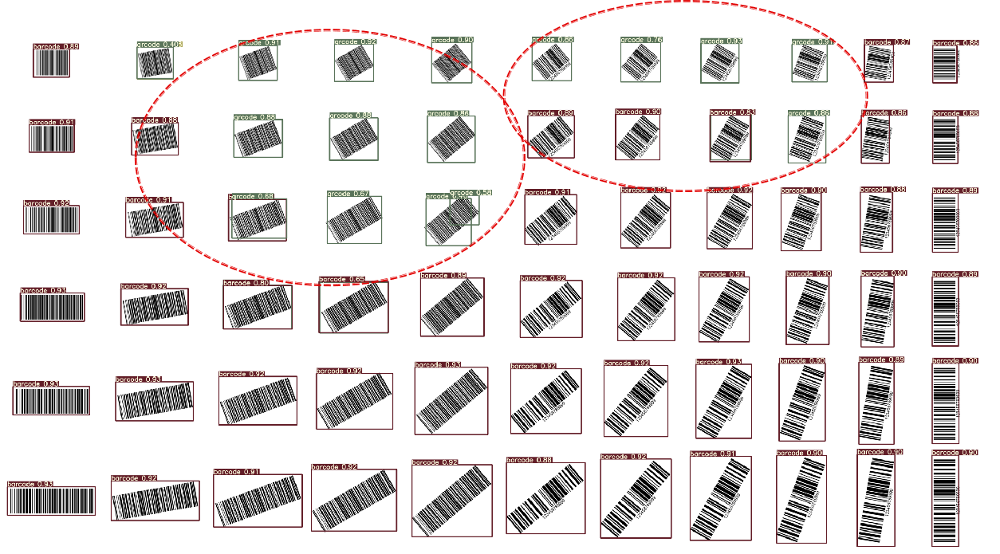

<div align='center' ><font size='10'><big><b>调参及边界检测测试报告</b></big></font></div>

[概要](#1-概要) 

[1. 调参及训练](#1-调参及训练)

[2. 边界测试结果及分析](#1-边界测试结果及分析)

[3. 补充320*320边界测试](#1-补充320*320边界测试)

[4. 总结](#1-总结)

# 概要

PC端，不同参数模型覆盖通用场景的测试情况，测试项加包括像素占比分析(目标占比、最大检测数量)、角度支持情况等。

**单独开启mosaic性能最佳，且对大角度旋转效果较理想，可支持到小目标级别识别，但是存在少量bbox小于gt情况。此外，img-size下降会显著影响小目标识别精度，但不影响argos常见场景下的识别。**

# 1 调参及训练

## 1.1 超参数说明

yolo工程有自带的超参数调整策略，整体思路就是设定各自超参数的突变值和突变范围，通过训练一定epochs来记录比较map。因此，超参数调整耗时巨大，**需要通过人工筛选较少超参数组合**，考虑到条码数据集类别较少，**调参主要针对数据增强相关系数**，以下是所有超参数说明：

```yaml
# ---学习率--- 与batch-size设置及模型选择有关
lr0: 0.01 #学习率  
lrf: 0.2    # 余弦退火超参数  
momentum: 0.937  # 学习率动量  
weight_decay: 0.0005  # 权重衰减系数  
warmup_epochs: 3.0  #预热学习epoch  
warmup_momentum: 0.8 #预热学习率动量  
warmup_bias_lr: 0.1 #预热学习率
# ---损失函数---  
box: 0.05  # giou损失系数  
cls: 0.5  # cls损失系数  
cls_pw: 1.0 #分类BCELoss中正样本的权重  
obj: 1.0  # 有无物体损失系数  
obj_pw: 1.0  # 有无物体BCELoss中正样本的权重  
iou_t: 0.2    # 训练时iou阈值  
anchor_t: 4.0  # anchor的长宽比
anchors: 3  # 每个output分配anchor数
fl_gamma: 0.0  # focal-loss系数
# ---数据增强相关系数(在mosaic阶段实现，包括mixup), 包括颜色空间和图片空间---
hsv_h: 0.015  # 色调  
hsv_s: 0.7   # 饱和度  
hsv_v: 0.4   # 明度  
degrees: 0.0 # 旋转角度  
translate: 0.1  # 水平和垂直平移  
scale: 0.5   # 缩放比例  
shear: 0.0  # 剪切  
perspective: 0.0  # 透视变换参数  
flipud: 0.0  # 上下翻转的概率  
fliplr: 0.5   # 左右翻转的概率 
mosaic: 1.0   #进行mosaic的概率  
mixup: 0.0  #进行mixup的概率
```

其中mosaic通过缩放、旋转、拼接增加样本多样性，而mixup可以增加大量伪数据来提升模型鲁棒性

## 1.2 不同数据增强训练策略

基于Vision001-yolo工程和最新条码数据集训练**通道减半模型**，图片输入尺寸为640*640

共识：数据增强会产生与真实样本较大的差异，最后几个epochs关闭数据增强进行微调，可达到牺牲少许得分，换取漏检率和误检率的降低的效果（模型拟合现实分布）

为此选取以下3个模型进行对比分析：

> ​	model1  --- 开启mosaic&mixup最后几个epochs关闭data_augment进行微调
> ​	model2  --- 开启mosaic最后几个epochs关闭data_augment进行微调
> ​	model3  --- 全程关闭data_augment

|        | mAP50-dm | mAP50-qr | mAP50-bar | mmAP-dm | mmAP-qr | mmAP-bar |
| :----: | :------: | :------: | :-------: | :-----: | :-----: | :------: |
| model1 |    1     |  0.999   |     1     |  0.906  |  0.933  |  0.896   |
| model2 |    1     |    1     |   0.998   |  0.904  |  0.938  |  0.897   |
| model3 |    1     |    1     |   0.998   |  0.902  |  0.927  |  0.880   |

性能测试结果如共识基本一致，此外开启数据增强可以加快模型收敛。

# 2 边界测试结果及分析

## 2.1 像素占比

yolo工程resize会根据图片长宽比进行等比例缩放(短边将用灰色填充)，而由于板端的输入尺寸是固定的，目前支持的输入尺寸是300x300,512x512, 640x640，因此不会因为resize策略不同而产生差异。即PC端测试结果与板端真实采集图像测试结果相似。

为尽可能模拟板端采集图像，本小节将对单个dmcode和qrcode(85x85像素)resize到不同分辨率，各模型(iou_thres=0.5)识别情况如下图


①针对dmcode，各模型在120-1400pixel范围检测效果趋于稳定，开启数据增强可以拓宽范围

②针对qrcode，各模型在100-1000pixe范围内区别并不大，而开启数据增强稳定范围将拓宽到1600pixe

综上，数据增强可以提升小目标的识别效果

## 2.2 角度支持

目前yolo工程并不支持旋转标注，因此部分倾斜样本标注由于空白(背景)信息过于冗余，将影响实际识别效果。本小节在2.1的基础上选取识别较稳定且较常见的分辨率范围，对旋转后的样本进行识别(iou_thres=0.5)

### 2.2.1 dmcode&qrcode

样本旋转梯度为15°，其中dmcode分辨率范围为(760~2065pixel)，qrcode分辨率范围为(960~2400pixel)。各模型效果比较相近。


上图为model2检测结果，能较好支持不同角度的识别，其中45°识别效果相对下降。

### 2.2.2 barcode

不同类型barcode具有不同的长宽比，本节固定barocde宽度为120pixel，长度从150以5opixel的梯度增长，条码占比范围在0.3%~0.7%。考虑到携带数字标识等信息影响识别效果，为此，左侧为无标识倾斜样本，右侧为有标识倾斜样本。以下依次为model1、model2、model3模型效果。




大占比情况下，各模型识别效果相近，但针对更小目标（长宽比越接近于1），数据增强会产生大量误检，并且倾斜角度趋于45°更为严重。原因是条码伪数据严重偏离真实样本，而且bbox越趋于正方形越容易识别为qrcode或者dmcode。

# 3 补充320*320边界测试

## 3.1 320*320模型性能

与640相比新增AIfial及塑料材质barcode样本，训练开启mosaic并在最后关闭augment进行微调。与640精度变化如下表：

| 模型 | mAP50-qr | mAP50-dm | mAP50-bar | mAP50-all |    mmAP-qr    |    mmAP-dm    |   mmAP-bar    |     mmAP-all      |
| :--: | :------: | :------: | :-------: | :-------: | :-----------: | :-----------: | :-----------: | :---------------: |
| 640  |  0.999   |    1     |   0.995   | **0.998** |     0.943     |     0.922     |     0.898     |     **0.921**     |
| 320  |  0.998   |  0.986   |   0.993   | **0.992** | 0.928(-0.015) | 0.869(-0.053) | 0.875(-0.023) | **0.891(-0.030)** |

相较于640版本，320版本的模型学习能力有所下降，原因是网络的特征提取能力有限，在分辨率下降时特征提取能力减弱。

## 3.2 测试集精度

640版本和320版本在测试集上的精度

| 模型 | mAP50-qr | mAP50-dm | mAP50-bar |   mAP50-all   |    mmAP-qr    |    mmAP-dm    |   mmAP-bar    |   mmAP-all    |
| :--: | :------: | :------: | :-------: | :-----------: | :-----------: | :-----------: | :-----------: | :-----------: |
| 640  |    1     |  0.998   |   0.993   |     0.997     |     0.946     |     0.921     |     0.889     |     0.919     |
| 320  |  0.997   |  0.986   |   0.99    | 0.991(-0.006) | 0.931(-0.015) | 0.862(-0.059) | 0.868(-0.021) | 0.887(-0.032) |

相较于640版本，320版本由于分辨率支持有所下降(见3.2)，因此精度有所下降(已排除新增样本的影响，即新增塑料材质barcode和AIfail样本均具有很高的置信度得分)，但在argos上并不会有太大区别。

## 3.3 边界测试结果汇总及对比

像素占比采用2.1相同方案，其中新增45°barcode。其中表格内为得分较稳定的分辨率范围

| 模型 | **dmcode(85*85)** | **qrcode(85*85)** | **barcode(260*85)** | **barcode-45°(260*85)** |
| :--: | :---------------: | :---------------: | :-----------------: | :---------------------: |
| 640  |     140-2000      |      85-1900      |      260-4000       |        260-4000         |
| 320  |     140-1500      |      85-1200      |      260-3200       |        260-2500         |

最大分辨率支持有不同程度下降，降幅大致为40%。320版本依旧能覆盖大部分场景，且基本不会存在截断现象，但是部分barcode依旧存在框小问题。

# 4 总结

目前通道减半模型能较好覆盖通用场景，相对而言识别效果dmcode>qrcode>barcode。而缩小img-size仍能保持较高精度，而小目标识别效果会大打折扣。

- [ ] 超参数调整，获取最优模型后再补充测试
