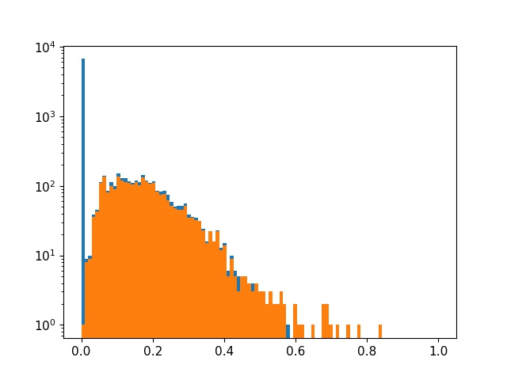

<div align='center' ><font size='10'><big><b>基于新数据剪枝测试报告</b></big></font></div>

[1. 工程准备](#1-工程准备) 

[2. 基于5s_640剪枝](#2-基于5s_640剪枝)

[3. 总结](#3-总结)

# 概要

对新数据集进行模型压缩，预期目标保留精度并将推理耗时缩短至20ms

# 1 工程准备

## 1.1 测试环境

主要依赖环境为服务器vision002-yolo工程

## 1.2 数据集

数据集中每个子类按划分比例20 : 4 : 1依次对训练集、验证集和测试集划分，得到24672张训练集样本，4617张验证集样本，1564张测试集样本。

```
dataset       30853张
├── dmcode     6929张   
│   ├── custom  819张
│   ├── dpm	    512张
│   ├── fitbit  694张
│   ├── foxcon  643张
│   └── nignde 4261张  
│  
├── qrcode     5600张
│   ├── argos  1836张
│   ├── chuanqi  82张
│   ├── custom  905张
│   ├── dingli   26张
│   └── rotate 2751张  
│  
├── barcode    9741张
│   ├── argos   811张
│   ├── chip    989张
│   ├── custom 2528张
│   ├── cyclops 299张
│   ├── dibai   618张
│   ├── ningde  336张
│   ├── plastic 333张
│   └── rotate 3827张
│
├── multicode  8062张
│   ├── custom  689张
│   └── manual 7373张 
│
└── AiFail      521张
```

注：按划分时不足一张的四舍五入，最后测试集划得剩下的。

# 2 基于5s_640剪枝

首先基于5s_640训练1050epochs得到基本拟合的原始模型，其精度如下

| 模型/测试集 | mAP-all | mmAP-all |
| :---------: | :-----: | :------: |
|   5s/val    |  0.998  |  0.923   |
|   5s/test   |  0.997  |  0.919   |

## 2.1 稀疏训练

稀疏阈值设置为sl_loss=6e-4，稀疏800epochs后sl_mloss基本收敛于0.004755，但是精度并未完全收敛

| 模型/测试集 | mAP-all | mmAP-all |
| :---------: | :-----: | :------: |
|   sl/val    |  0.998  |  0.912   |
|   sl/test   |  0.998  |  0.911   |

精度相对5s模型有所降低，后续需要增加epochs

## 2.2 剪枝

### 2.2.1 稀疏分布

剪枝阈值设置为依次为0.01、0.1、0.15，下图为稀疏分布后的剪枝示意图。其中蓝色为稀疏度低于0.01以及由于通道对齐所删减部分，橙色为通道保留部分

<center></center>

### 2.2.2 剪枝比例

考虑到海思平台特殊性，需要对通道数进行8倍补齐。补齐后各卷积层的通道剪枝情况如下图所示，其中蓝色为目前通道数，橙色为已修剪部分。

|       模型       | backbone剪枝比例 | head剪枝比例 | 总体剪枝比例 |
| :--------------: | :--------------: | :----------: | :----------: |
|     1/2通道      |       50%        |     50%      |     50%      |
| nas_0.01(large)  |                  |              |              |
| nas_0.10(middle) |                  |              |              |
| nas_0.15(small)  |      75.5%       |    88.6%     |    83.6%     |

## 2.3 模型微调-val集测试

基于剪枝网络结构重新训练模型，其收敛速度相较于通道减半有所降低。下表为各模型在val集上的测试效果，对比各模型学习能力，其中conf-thres=0.5

|       模型       | mAP-dm | mAP-qr | mAP-bar | ⭐mAP-all | mmAP-dm | mmAP-qr | mmAP-bar | ⭐mmAP-all |
| :--------------: | :----: | :----: | :-----: | :------: | :-----: | :-----: | :------: | :-------: |
|        5s        | 0.998  | 0.999  |  0.997  |  0.997   |  0.921  |  0.943  |  0.905   |   0.923   |
| nas_0.01(large)  |        |        |         |          |         |         |          |           |
| nas_0.10(middle) | 0.999  | 0.998  |  0.996  |  0.998   |  0.906  |  0.932  |  0.884   |   0.907   |
| nas_0.15(small)  | 0.998  | 0.996  |  0.995  |  0.996   |  0.896  |  0.924  |   0.87   |   0.897   |
|       1/2        |   1    | 0.999  |  0.995  |  0.998   |  0.922  |  0.943  |  0.898   |   0.921   |
|     1/2_320      | 0.998  | 0.999  |  0.995  |  0.997   |  0.891  |  0.93   |  0.879   |   0.900   |

## 2.4  测试结果汇总

### 2.4.1 测试集精度

由于数据集中含有大量小目标和模糊样本，其识别得分往往较低，因此mmAP可理解为困难样本的识别性能评价。conf-thres=0.5

|       模型       | mAP-dm | mAP-qr | mAP-bar | ⭐mAP-all | mmAP-dm | mmAP-qr | mmAP-bar | ⭐mmAP-all |
| :--------------: | :----: | :----: | :-----: | :------: | :-----: | :-----: | :------: | :-------: |
|        5s        | 0.998  |   1    |  0.994  |  0.997   |  0.918  |  0.944  |  0.894   |   0.919   |
| nas_0.01(large)  |        |        |         |          |         |         |          |           |
| nas_0.10(middle) |   1    |   1    |  0.994  |  0.998   |  0.904  |  0.937  |  0.873   |   0.905   |
| nas_0.15(small)  |   1    | 0.997  |  0.993  |  0.997   |  0.891  |  0.927  |   0.86   |   0.893   |
|       1/2        | 0.998  |   1    |  0.993  |  0.997   |  0.921  |  0.946  |  0.889   |   0.919   |
|     1/2_320      | 0.997  | 0.996  |  0.991  |  0.995   |  0.888  |  0.926  |  0.869   |   0.895   |

![[基于新数据剪枝测试报告]各模型测试性能对比](.\img\[基于新数据剪枝测试报告]各模型测试性能对比.png)

### 2.4.2 网络结构参数及速度

基于GPU统计推理耗时，其与计算量FLIOPs呈正相关。

|       模型       | 模型大小 | 参数量 | 推理耗时 | FLOPs | 备注 |
| :--------------: | :------: | :----: | :------: | :---: | :--: |
|        5s        |  14.3M   | 7.05M  |  2.0ms   | 17.5G |      |
| nas_0.01(large)  |          |        |          | 4.9G  |      |
| nas_0.10(middle) |   1.1M   | 0.41M  |  0.9ms   | 3.9G  |      |
| nas_0.15(small)  |   603K   | 0.20M  |  0.7ms   | 1.9G  |      |
|       1/2        |   3.9M   | 1.77M  |  1.0ms   | 4.5G  |      |
|     1/2_320      |   3.9M   | 1.77M  |  0.6ms   | 4.5G  |      |

### 2.4.3 小结

1/2模型还有压缩空间，后续增大剪枝阈值得到多组剪枝模型在测试精度。但是在640图片尺寸下推理耗时基本不能缩减至20ms，而1/2_320模型精度下降明显且推理耗时也没有达到预期，因此**后续要对320尺寸剪枝且精度评价指标参考map**。

# 3 总结

## 3.1 后续改进方向

 包括结果分析，原因分析，总结；并指出后续改进方向。

- [ ] todo